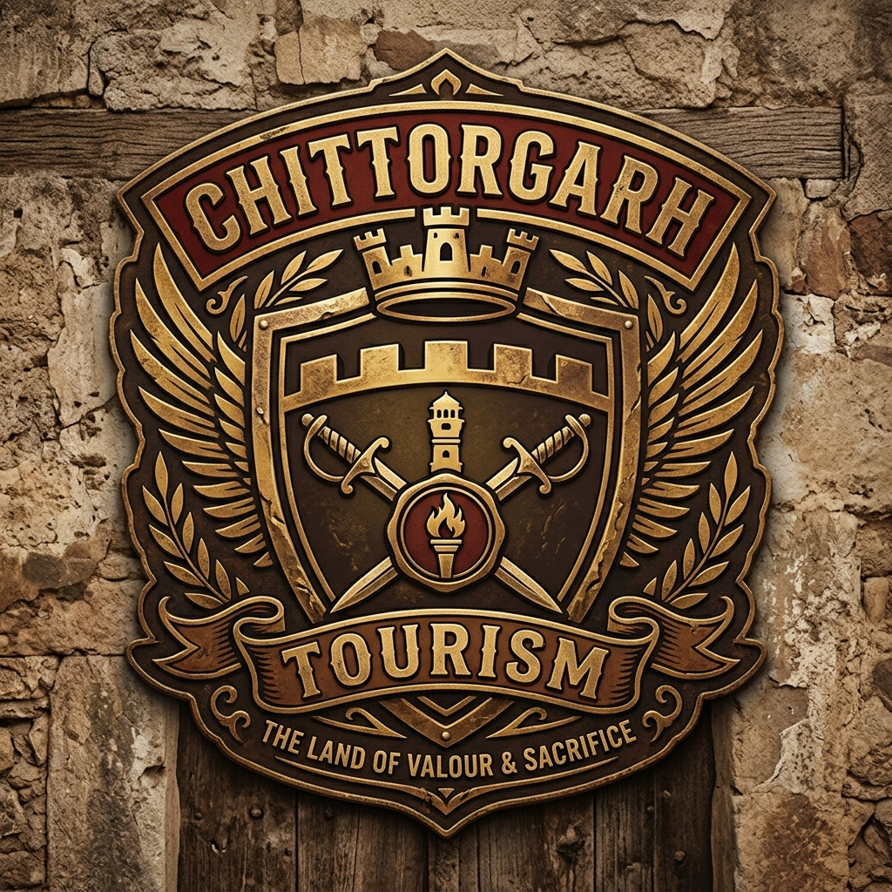

# Chittorgarh Tourism Logo Proposals

I have copied the logo images to your `public` folder so you can view them directly in your file tree or by opening them.

Here are the options:

### Maharana Pratap & Rajasthani Theme (New)

These options are inspired by Maharana Pratap and the Rajasthani heritage, with text at the bottom.

#### Option 4: Warrior Silhouette & Fort
- **File**: `public/logo_maharana_1.png`
- **Preview**:

---

#### Option 5: Mewar Crest Inspired
- **File**: `public/logo_maharana_2.png`
- **Preview**:

---

#### Option 6: Rajasthani Architecture (Jharokha)
- **File**: `public/logo_maharana_3.png`
- **Preview**:

---

#### Option 7: Minimalist Warrior Shield
- **File**: `public/logo_maharana_4.png`
- **Preview**:

---

### Previous Options

#### Option 1: Heritage & Royalty (Original)
- **File**: `public/logo_heritage.png`
- **Preview**:

---

#### Option 1 (Latest Attempt): Heritage with Text (V4)
- **File**: `public/logo_heritage_v4.png`
- **Preview**:

---

#### Option 2: Modern & Minimalist
- **File**: `public/logo_modern.png`
- **Preview**:

---

#### Option 3: Badge Style (Rustic)
- **File**: `public/logo_badge.png`
- **Preview**:

Please check the `public` folder in your project to view the images directly if the preview doesn't work here.
